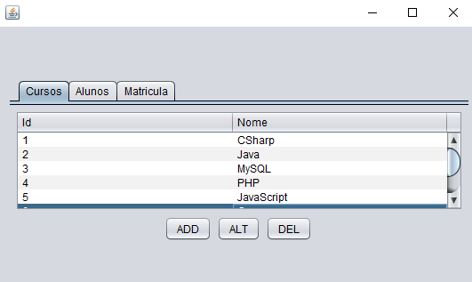

# Escola Técnica - Cadastro de Cursos e Alunos

## Projeto simples de Cadastro de uma Escola Técnica onde utilizo JDBC, JFrame (Interface Desktop) e o MySQL.

**Java Database Connectivity** ou **JDBC** é um conjunto de classes e interfaces escritas em Java que fazem o envio de instruções SQL para qualquer banco de dados relacional. Para comunicarem-se com o banco de dados os programas em java utilizam a **API JDBC**, que conecta com o SGBD e permite a manipulação do mesmo. Tal conectividade ocorre através de um driver que é fornecido pelos próprios SGBD ou por fontes independentes.

**JFrame** é uma Classe do Java, especificamente, do pacote Swing é por meio do **JFrame** que é possível criar uma aplicação com tela desktop, com telas, botões, tabelas, etc.

## Padrão de Projeto - Data Acess Object (DAO)

Foi utilizado o padrão DAO para persistir os dados no MySQL.
**Data Acess Object** ou **DAO** é um padrão para aplicações que utilizam persistência de dados, onde tem a separação das regras de negócio das regras de acesso a banco de dados.

## Padrão de Arquitetura - Model, View and Controller (MVC)

### Model ou Modelo ###
Essa classe também é conhecida como Business Object Model (objeto modelo de negócio). Sua responsabilidade é gerenciar e controlar a forma como os dados se comportam por meio das funções, lógica e regras de negócios estabelecidas. 

### Controller ou Controlador ###
A camada de controle é responsável por intermediar as requisições enviadas pelo View com as respostas fornecidas pelo Model, processando os dados que o usuário informou e repassando para outras camadas. 

### View ou Visão ###
Essa camada é responsável por apresentar as informações de forma visual ao usuário. Em seu desenvolvimento devem ser aplicados apenas recursos ligados a aparência como mensagens, botões ou telas. 

Utilizei técnicas do MVC apesar de não se utilizar amplamente do padrão no projeto, já que não implementei a Controller, apenas a View, como pacote **_visao_**, na qual implementei a classe EscolaGUI.java e a Model separando os pacotes **_bd, dao, entidade e mensagem_** no pacote principal **_modelo_**.

## Tela JFrame ##

